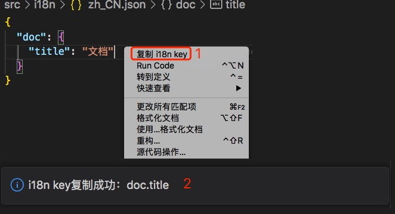
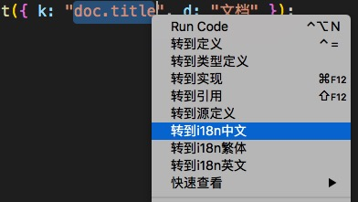
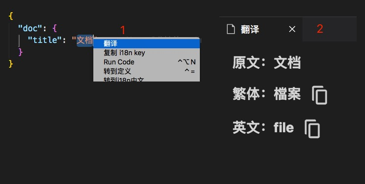

# i18n 小工具

## 功能

### 一、复制翻译文件 key

1. 打开 src/i18n/\*.json，选中行（任意位置）
2. 右键复制 i18n key

### 二、跳转至翻译文件

1. 打开任意文件，选中 k。如："doc.title"
2. 右键跳转 i18n

### 三、翻译文件相互跳转

1. 打开 src/i18n/\*.json，选中行（任意位置）
2. ctrl/command + 左键

### 四、翻译（只支持百度）

1. [申请通用文本翻译 API](https://fanyi-api.baidu.com/product/11)
2. 插件配置：设置 -> 扩展 -> 国际化翻译插件
3. 打开 src/i18n/\*.json，选中文本，右键翻译（目前只支持翻译为英文、繁体）

