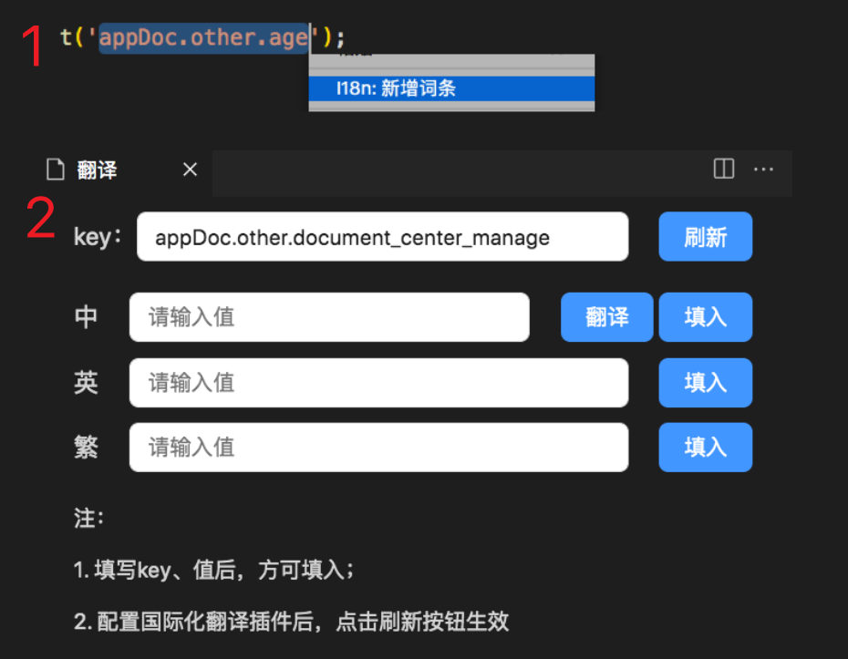
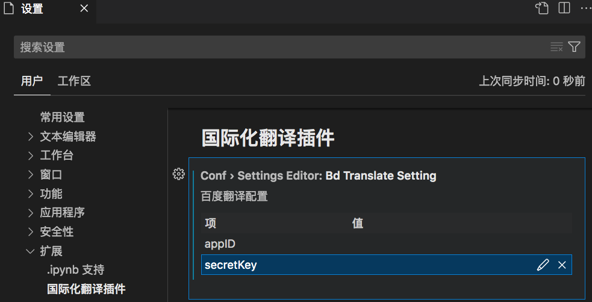
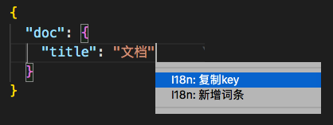
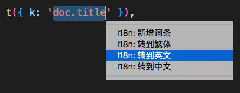
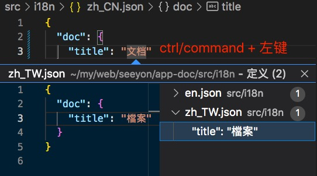

# i18n 小工具

## 功能

### 一、快速新增词条

1. 任意编辑器
2. 右键，新增词条（可选中文本）

注：翻译配置请看二

### 二、国际化翻译配置（只支持百度）

1. [申请通用文本翻译 API](https://fanyi-api.baidu.com/product/11)
2. 插件配置：设置 -> 扩展 -> 国际化翻译插件
   

### 三、复制翻译文件 key

1. 打开 src/i18n/\*.json，选中行（任意位置）
2. 右键复制 i18n key

### 四、跳转至翻译文件

1. 打开任意文件，选中文本。如："doc.title"
2. 右键跳转

注： 新增、删除文件可能导致菜单更新不及时，请运行> I18n: 重启转到功能

### 五、翻译文件相互跳转

1. 打开 src/i18n/\*.json，选中行（任意位置）
2. ctrl/command + 左键

